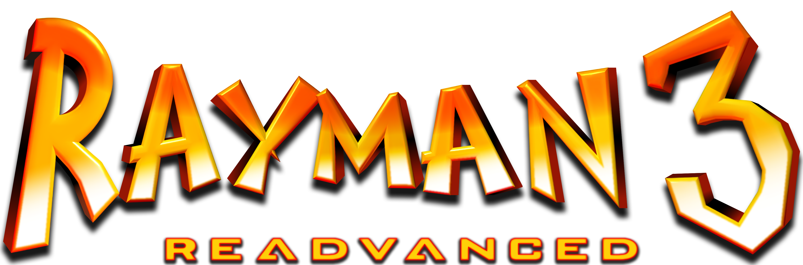
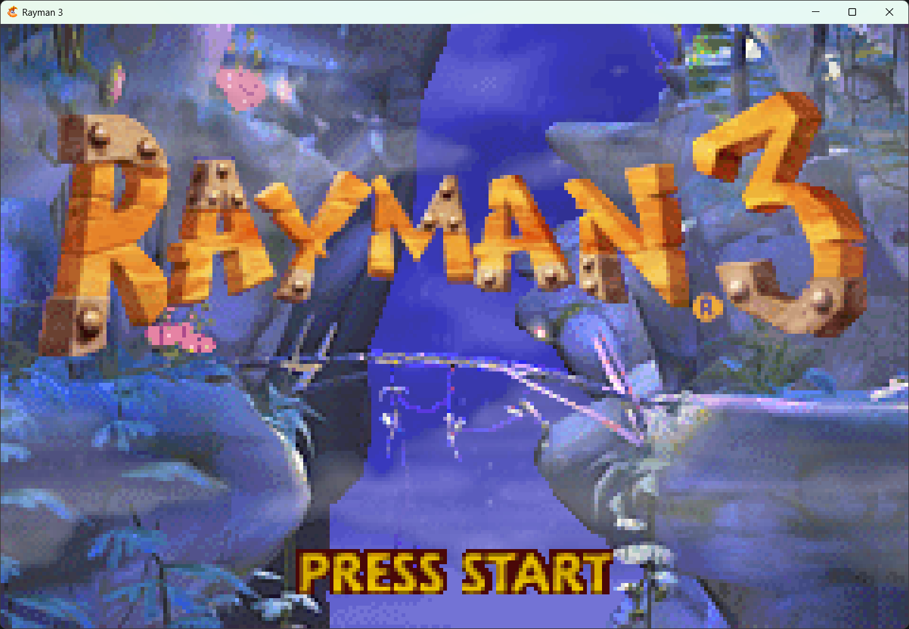
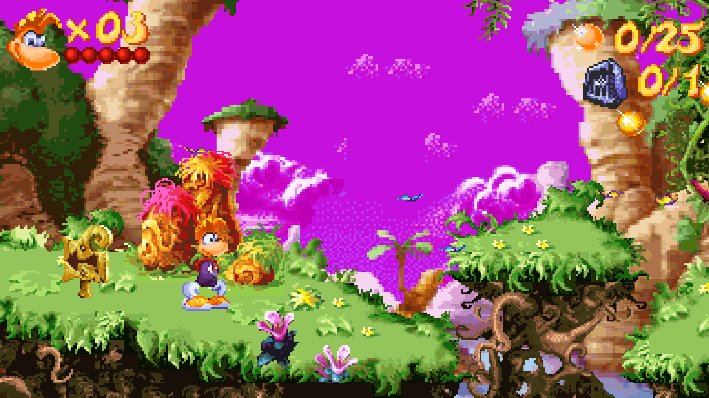

# Rayman 3 Readvanced


This project is a recreation of the Game Boy Advance and N-Gage versions of Rayman 3 to [MonoGame](https://monogame.net), with the goal of porting the game to PC and other platforms. The original ROM is required to play the game since this project does not contain the game assets.

This is not meant to be a traditional decompilation, but rather a recreation of the game in C#. However, the game code is written to be functionally identical to the original code and much of the same structure of the original engine is kept, as seen by decompiling the game using Ghidra.


*The goal is to have the game be functionally identical to the original GBA game, while modernizing the code and including optional game enhancements.*

You can view the current progress of this port under [Progress](PROGRESS.MD).

## GbaEngine
The original game uses [Ubisoft's GbaEngine](https://raymanpc.com/wiki/en/GbaEngine), an engine which was written in C and built from Ubisoft's Game Boy Color engine. The engine is object-oriented, which makes it work well for a C# re-creation, and consists of several, mostly independent, modules.

See the [documentation](gbaengine/documentation.md) for more information on the engine, what code changes this port has made and other technical details.

## Enhancements
This version contains several optional enhancements over the original game. The most notable is that the game can be played in high resolution and widescreen. This provides a much better experience on modern devices as you're no longer limited to the small screen of the GBA.

Besides graphical enhancements there are various quality of life improvements and optional gameplay tweaks which can be toggled. There is also an assortment of bonus features, such as built-in achievements and more.


*The game can render in higher resolution and different aspect ratios.*

## Playing
*NOTE: This port is still in development which is why there are no releases published. Most levels are not yet playable.*

In order to play the game you will need to place your game ROMs in the `Data/Games` folder, inside a sub-folder for each game. The name of the ROM file doesn't matter, as long as it has the correct file extension (.gba for GBA and .app for N-Gage). Additionally the N-Gage version requires a .dat file with the same name as the .app file.

This is an example of a folder structure which will allow you to play both the GBA and N-Gage versions:

```
├───GBA
│   └── ROM.gba
└───N-Gage
    ├── rayman3.app
    └── rayman3.dat
```

The game saves are stored in `.sav` files with the same name as the ROM. The format is identical to that used by GBA emulators, and save files can thus be interchanged.

### Button mapping
The button mapping will be made customizable in the future, along with controller support. As of now this is the current mapping:

| **Description**          | **Input**          |
|--------------------------|--------------------|
| GBA A-button             | Space              |
| GBA B-button             | S                  |
| GBA Select-button        | C                  |
| GBA Start-button         | V                  |
| GBA D-pad                | Arrow keys         |
| GBA R-button             | W                  |
| GBA L-button             | Q                  |
| Toggle pause             | Ctrl+P             |
| Speed up game            | Left shift         |
| Run one frame            | Ctrl+F             |
| Toggle debug mode        | Tab                |
| Toggle menu              | Escape             |
| Toggle showing collision | T                  |
| Toggle no-clip           | Z                  |
| Increase no-clip speed   | Space              |
| Scroll camera            | Right mouse button |
| Toggle fullscreen        | Alt+Enter          |

Besides these you can also hold down `left shift` while resizing the window to maintain the aspect ratio.

You can also launch the game with a BizHawk .bk2 TAS file which will have it play the button inputs from that.

## Debug mode
Pressing the `tab` key while playing will toggle the debug mode. This is set up using ImGUI and is meant to help debugging the game.


*The debug mode allows for visualization and editing of the current engine data and state.*

## Credits
- **RayCarrot**: Main developer, game formats reverse engineering
- **Droolie**: Game formats reverse engineering
- **XanderNT**: Rayman 3 Readvanced logo
- **Miles**: Extracting the GBA sounds
- **Robin**: General MonoGame and shader help

## Want to help?
Do you want to help out? Feel free to contact me if so! This is currently a side project and might take a long time to finish, especially when being worked on by only myself.