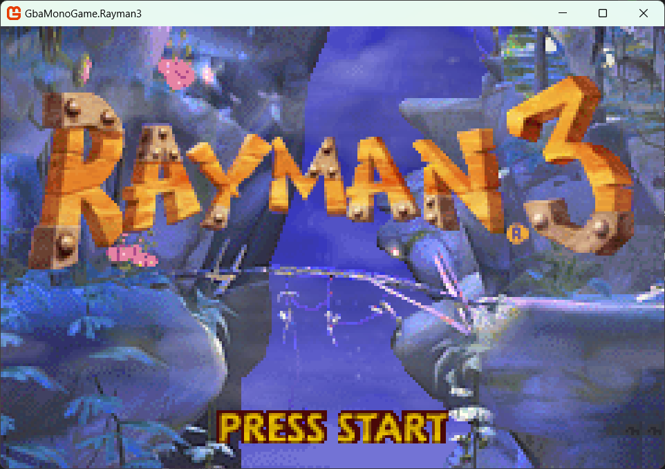
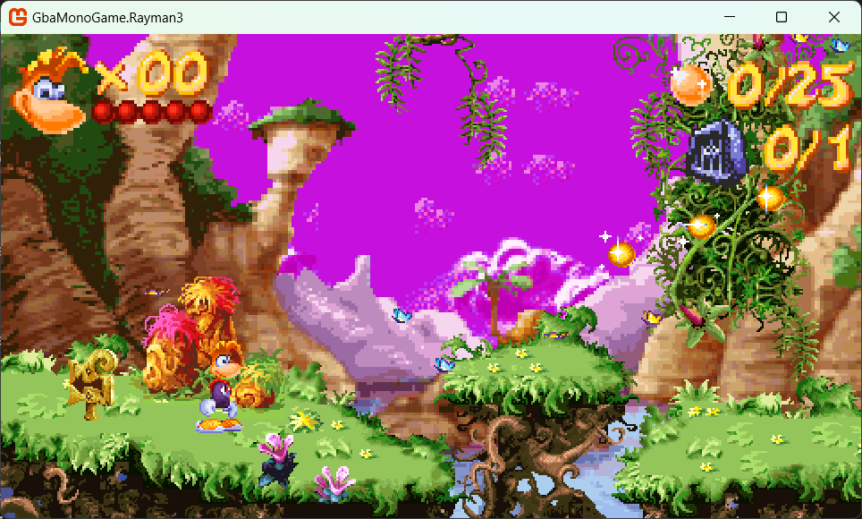
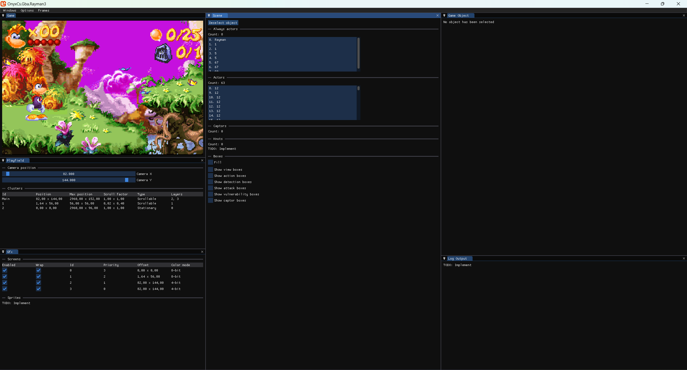

# Rayman 3 GBA port to MonoGame
This project is a recreation of Rayman 3 GBA to MonoGame, with the goal of porting the game to PC and other platforms. This is *not* a decompilation or source port, but rather a recreation in C#. It is however heavily based on the original engine, attempting to keep much of the same structure as seen by decompiling the game using Ghidra.

# Engine
The original engine was written in C++ and appears to be built from Ubisoft's GBC engine. The name is unknown, although it appears to have later been worked into the Onyx engine, thus will be named as such in this project. The engine consists of the following modules:

#### GbaCommon
- **GbaSDK** - reusable code for any GBA game, such as display drivers, a graphics engine for allocating tiles in an optimized way and network code for multiplayer.
- **GbaStdLib** - mainly a memory manager for allocating memory and sound code for playing music.

#### GbaSimilar
- **GbaAnimation** -  different types of animated objects which can be played with the animation player as well as palette and sprite managers.
- **GbaTileGraphics** - playfield, along with different types of game layers, and cameras for scrolling.
- **Gba2DPlatform** - components for a 2D platformer, such as actors, captors, scenes, knots and more.

## ROM
The majority of the game data in the ROM is stored as resource blocks in a data table. Each resource has a list of dependencies, which are resources it links to. [BinarySerializer.Onyx.Gba](https://github.com/BinarySerializer/BinarySerializer.Onyx.Gba) is being used to deserialize this data from the ROM.

## Frame
A `frame` is what determines the current game loop. Only one frame instance can be executing at a time. For example, the intro and main menu are two examples of different frames. The same goes for each level and the different cutscenes (acts).

## Playfield
A `playfield` is a collection of different game layers. These can be tile graphics or physical layers (for collision). Layers are grouped into `clusters` which are what the camera scrolls. Each cluster has a different scroll speed, thus allowing layers to produce a parallax scrolling effect. Besides this additional effects can be applied such as animated tiles and palette swapping.

## Scene
Each level in the game consists of a scene. A scene mainly consists of a playfield, a `camera actor`, a collection of `game objects` and `dialogs`. A dialog is a some form of UI element that renders to the screen, such as the HUD.

These are the following types of game objects used in Rayman 3:

- **Actor** - an object which has an animated object and code to execute each frame. These are the objects you see in a level, such as enemies, moving platforms and butterflies.
- **Always actor** - actor which stays enabled until manually disabled. These are usually disabled at the start and then loaded in when used by other actors, such as a water splash from the water.
- **Captor** - objects which trigger events when an actor collides with its box.

## States and messages
Most objects in the game communicate by having a `ProcessMessage` function. This allows it to retrieve a specific type of message, identified by an id, and optional parameters. Most objects also contain a finite-state machine which runs each frame. This determines the current state the object is in and which behavior it should perform.

# MonoGame port
The MonoGame port of this engine, currently named `OnyxCS` (Onyx C#) is still early in development. There are several noticeable changes from the original engine, such as relying less on singleton instances and using floats instead of fixed-point integers.

## Rendering
The original game renders data by loading it into VRAM on the GBA. It also does some rather unique rendering tricks by setting up vsync callbacks which occur after each scanline is drawn. This allows for special effects such as level transitions, clouds scrolling at different speeds and much more.

Initially this project was set up to manually draw each game frame, pixel by pixel and emulate how the GBA handles drawing. This however came with major performance costs and was later changed into rendering using textures. Each sprite is now a texture, as well as the backgrounds. Certain effects might not be replicated exactly the same as on a GBA, such as affine sprite rendering and alpha blending, but the goal is to have it appear as similar as possible.

*The goal is to allow the game to render in higher resolution and different aspect ratios*

## Debug mode

Pressing the `escape` key while playing will toggle the debug mode. This is set up using ImGUI and is meant to help debugging the game. Other debug options available are the ability to zoom in and out of the game with the mouse wheel and scroll through playfields using the mouse while holding down the right mouse button.

# Decompiling
The engine is being recreated thanks to Ghidra allowing the original game's code to be decompiled. There are mainly 3 versions which are worth mentioning here:

- **Rayman 3 (GBA)** - the original game on the GBA is what this achieves to recreate. However the code isn't always easy to read here due to heavy optimizations made by the compiler, mainly a lot of functions being inlined.
- **Rayman 3 (N-Gage)** - this version has a lot fewer optimizations and no apparent inlining, making it much easier to follow along. It does however have some changes from the GBA version and should thus not be used by itself.
- **Rayman 3 (GBA - Prototype)/Splinter Cell (GBA - Prototype)** - these two prototypes were compiled with assertions in the code, which contain debug strings for if the assertions fail. These are incredibly useful as they contain function names, variable names, source file paths and more.

# Want to help?
Do you want to help out? Feel free to contact me if so! This is currently a side project and might take a long time to finish, especially when being worked on by only myself.